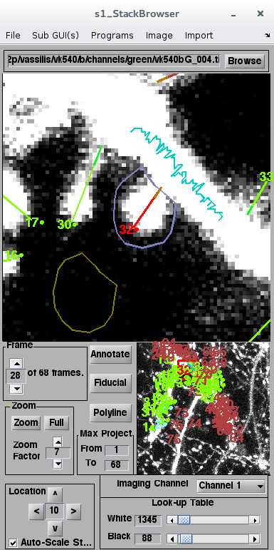

+++
title = "Image annotation with ScanImage in MATLAB"

date = 2018-06-23
lastmod = 2018-06-23
draft = false

tags = ["MATLAB", "image_analysis", "neuroscience", "software"]
summary = "Longitudinal tracking of image features"
abstract =  "Longitudinal tracking of image features"
authors = ["Vassilis Kehayas"]
hasPlotly = false
doi = ""
sourceFile = "index.md"

+++

Using two-photon microscopy, we can observe microscopic structures such as
dendritic spines in the living brain of mice.
We can then follow them over time and observe their dynamics,
such as changes in their numbers, their size, or
[their positions]().
For my Ph.D. project, I used the annotation module of ScanImage
to track dendritic spines over time.

## Annotation and photometry modules



In the example above, the tool is focused on a spine, numbered $32$,
that is marked with a red line.
Using this identity, we can track the same spine over time
and observe whether it persists or disappears.
I also drew an outline around the spine, shown in purple,
to calculate the sum of fluorescence intensity for the pixels included
in this area, which can provide an estimate of the spine's size.
However, this value is not very meaningful by itself
as the overall imaging conditions can affect its magnitude
and those conditions can change from one imaging session to the next,
especially over long periods of time.

I applied two corrections to address this issue.
First, I drew a line on the dendrite close to the base of the spine.
I assume that the dendrite's fluorescence intensity remains
approximately the same across imaging sessions,
so I can normalize spine intensity to the dendrite's
average fluorescence intensity to correct for any longitudinal variations.
Additionally, I can refine the measurement by subtracting
the background's average fluorescence intensity,
obtained from the pixels included in the olive outline next to the spine.
However, for very small spines,
the sum of fluorescence intensity of pixels inside the purple outline
can be lower than the average background value if the purple outline includes
many values close to the background average fluorescence.
To correct for this nonlinear artefact that
disproportionally affects small spines, I only consider fluorescence values
from the purple outline that are above the average background fluorescence.
Since I subtract the average background value
from pixels in the purple outline
I also need to subtract it from the average dendritic fluorescence intensity.
The final formula to calculate the corrected, integrated fluorescence intensity
of a spine is thus:

$$ i\_{spine} = \frac{\sum\limits\_{px = 1}^{n} \\{ \color{#66c}{i\_{px}} | {\color{#66c}{i\_{px}} > \color{#660}{\overline{i\_{b}}}} \\} - \color{#660}{\overline{i\_{b}}} } {\color{#0cc}{\overline{i\_{d}}} - \color{#660}{\overline{i\_{b}}} } $$

where $\color{#66c}{i\_{px}}$ is the fluorescence intensity value
of each of $n$ pixels inside the purple outline around a spine,
$\color{#660}{\overline{i\_{b}}}$ is the average pixel value inside
the olive outline on the background,
and $\color{#0cc}{\overline{i\_{d}}}$ is the average pixel value of
the teal line along the dendrite.

I used my own customized version of ScanImage,
which you can find in a git repository:  

https://gitlab.com/vkehayas-public/MATLAB/image-analysis/vk_ScanImage

In addition to only returning the values for above-background pixels for spines,
the most important changes I have implemented are:

* I fixed a bug where the median of the dendritic intensity was calculated
when the option to calculate the mean was chosen,
and the reverse was true when the median was chosen.
* I expanded the allowed range of values for the image lookup tables to include
the full range of 16 bit images instead of the hard-coded maximum value of 2000.
* I remapped the navigation buttons to
<kbd>W</kbd>, <kbd>A</kbd>, <kbd>S</kbd>, and <kbd>D</kbd>, for up, left, down, and right, respectively.
I also set <kbd>Q</kbd> and <kbd>E</kbd> for navigation along the Z axis of the stack,
<kbd>Space</kbd> to initiate a line annotation,
and <kbd>R</kbd> to save annotations to a pre-existing ANN file.

For more details on the changes I introduced, please visit the link above.

## Preserving ScanImage headers of an externally processed image stack

It is not unlikely that someone would want to pre-process an image stack
before annotating it with ScanImage.
For example, filtering or deconvolution can aid the task of visually identifying
microscopic structures such as dendritic spines in noisy images.
However, ScanImage creates a header when it acquires an image,
that consists of a MATLAB structure object which contains information
about the acquisition parameters.
External programs, such as Fiji,
overwrite the header of the file with their own when saving it.
If the annotation module of ScanImage fails to find
the expected MATLAB structure in the header,
it is unable to load the image.
When the image file is then re-opened with the annotation module of ScanImage
you get an error:

```
Warning: Failed to open image file: /Path/to/externally_edited_file.tif - Cell contents indices must be greater than 0
> In stackBrowser>loadImage (line 824)
  In stackBrowser>fileBrowseButton_Callback (line 786)
  In gui_mainfcn (line 95)
  In stackBrowser (line 45)
```

Probably my most popular piece of code,
but certainly not the most sophisticated,
is a set of two functions that solve this problem.
Provided that we still have access to the original TIFF file
created by ScanImage during acquisition
that's an easy problem to fix.
We just need to extract the original header
and append it to the externally processed file.

First, I define a MATLAB function that exports the headers
from the original image stacks acquired with ScanImage:

```matlab
function [] = export_headers(varargin)
%% EXPORT_HEADERS Export headers from TIFF images acquired with ScanImage
%
%   export_headers() will ask you to select a directory that
%   contains a number of TIFF images acquired with ScanImage, and an
%   output directory in which to save the headers as separate MAT files for
%   each TIFF image stack. Max projection files are ignored.
%
%   export_headers(directoryIN, directoryOUT) will use
%   directoryIN as the input directory and directoryOUT as the output
%   directory
%
%   Vassilis Kehayas, November 2016

%%
if isempty(varargin)
    dirIN = uigetdir('', ...
                     'SELECT INPUT DIRECTORY');
    dirOUT = uigetdir(dirIN, ...
                      'SELECT OUTPUT DIRECTORY');
else
    dirIN = varargin{1};
    dirOUT = varargin{2};
end

files = listdir(dirIN,1);

for ii = 1:length(files)

    [~, fileName, fileExt] = fileparts(files{ii});

    if ((exist(files{ii}, 'file') ~= 7) ...
        && ~isempty(strfind(fileExt,'tif')) ...
        && isempty((strfind(fileName,'max'))))
        info = imfinfo(files{ii});
        headerInfo = info(1).ImageDescription; %#ok<NASGU>
        save(fullfile(dirOUT, ['h_' fileName]), 'headerInfo')
    end

end

end
```

To insert the original headers back into the edited files,
I use another MATLAB function:

```matlab
function [] = insert_headers(varargin)
%% INSERT_HEADERS Insert headers to TIFF images acquired with ScanImage
%
%   insert_headers() will ask you to select a directory that contains image
%   headers as MAT files and a directory within which to create a directory
%   called 'with_headers' to store the TIFF files with the original headers
%   inserted. Max projection files are ignored. Any existing contents in
%   the directory 'with_headers' will be deleted before storing the output.
%
%   insert_headers(headerDir, directoryOUT) will use 'headerDir' as the
%   directory containing the headers and 'directoryOUT' as the output
%   directory.
%
%   Vassilis Kehayas, November 2016

%% Choose directories
if isempty(varargin)
    headerDir = uigetdir('', ...
                         'SELECT DIRECTORY CONTAINING HEADERS');
    dirOUT = uigetdir(headerDir, ...
                      'SELECT DIRECTORY CONTAINING FILES FOR EDITING');
else
    headerDir = varargin{1};
    dirOUT = varargin{2};
end

display(['Input Directory is ' headerDir])
display(['Output Directory is ' dirOUT])

writeDirOUT = fullfile(dirOUT, 'with_headers');
if exist(writeDirOUT,'dir') ~= 7
    mkdir(writeDirOUT);
else
    delete([writeDirOUT filesep '*'])
end

%% Get headers
filesIN = listdir(headerDir, 1);
headerFiles = filesIN(~cellfun(@isempty, ...
                               strfind(filesIN, ...
                               '.mat')));

headers = cell(length(headerFiles), 1);
headerFileName = cell(length(headerFiles), 1);
for ii = 1:length(headerFiles)

    [~, headerFileName{ii}] = fileparts(headerFiles{ii});

    if ((exist(headerFiles{ii}, 'file') ~= 7) ...
        && isempty((strfind(headerFileName{ii}, 'max'))))
        load(headerFiles{ii})
        headers{ii} = headerInfo;
    end

end

%% Get TIFF files and match them to headers
tif2edit = listdir(dirOUT, 1);
counter = 0;
for jj = 1:length(tif2edit)

    [~, tifFileName, tifFileExt] = fileparts(tif2edit{jj});

    if ((exist(tif2edit{jj}, 'file') ~= 7) ...
        && ~isempty(strfind(tifFileExt,'.tif')) ...
        && isempty((strfind(tifFileName,'max'))))
        counter = counter + 1;

        if ~isempty(strfind(headerFileName{counter}, ...
                            tifFileName))
            info = imfinfo(tif2edit{jj});

            % Loop through slices
            for kk = 1 :length(info)

                temp_image = imread(tif2edit{jj}, kk, 'Info', info);
                IMAGE = uint16(temp_image);

                imwrite(IMAGE, ...
                        [writeDirOUT filesep tifFileName '.tif'], ...
                        'Description', headers{counter}, ...
                        'WriteMode', 'append', ...
                        'Compression', 'none');
            end

        else
            error('Name mismatch between header files and images')
        end

    end

end
```

The source files for header manipulation are included
in a separate git repository:
https://gitlab.com/vkehayas-public/MATLAB/image-analysis/tif-headers
